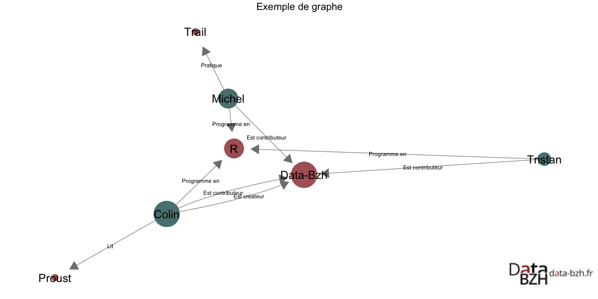
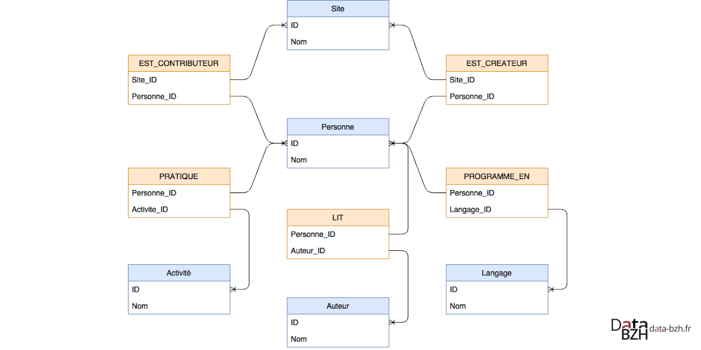
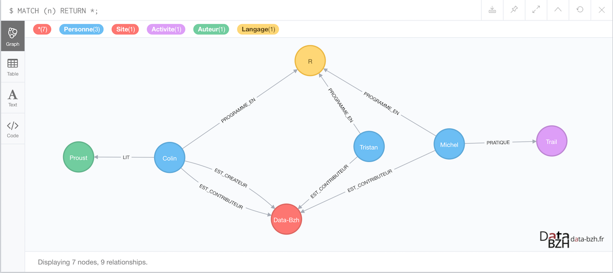
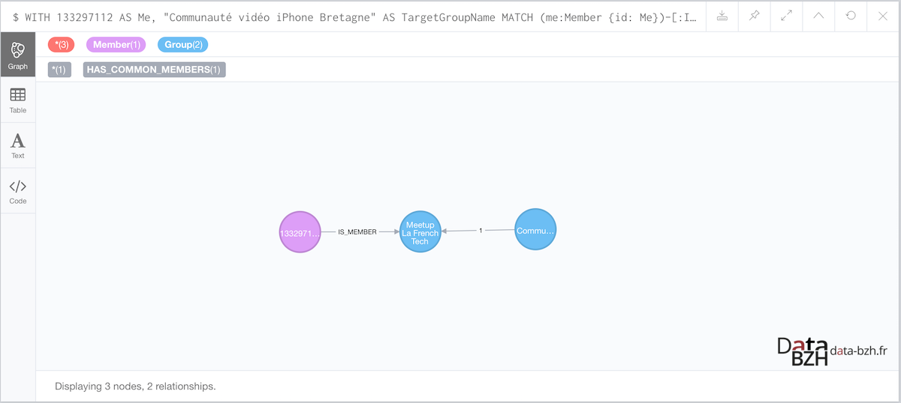
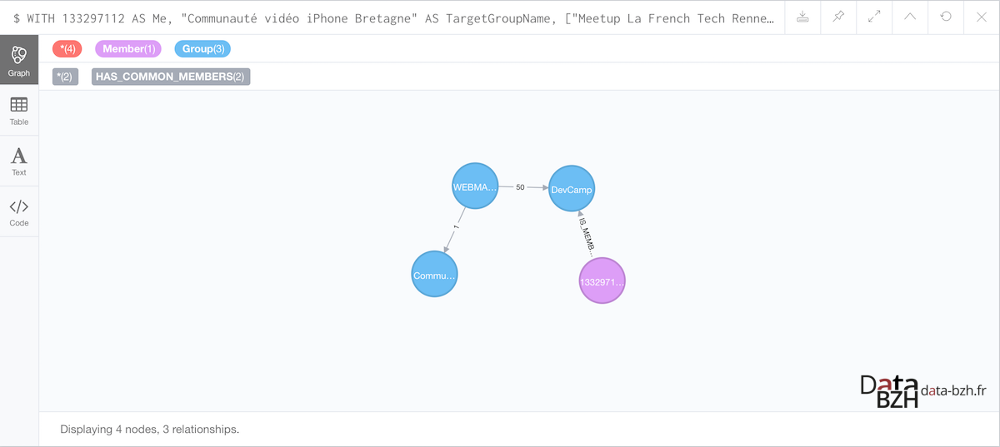

```{r Setup, echo = F}
library(curl)
library(RNeo4j)
source("../DataBzhTools/main.R")
source("config.R")
```

Dans le [précédent article](http://data-bzh.fr/groupes-meetup-a-rennes-partie-2/), nous avons exploré les **Meetups rennais** à l'aide de visualisations restituant les données sous forme de graphes.

Pour ce faire, nous nous sommes appuyés sur la capacité des librairies **[igraph](https://cran.r-project.org/package=igraph)** et **[ggraph](https://cran.r-project.org/package=ggraph)** du langage **[R](https://www.r-project.org/)**, qui proposent de nombreuses fonctionnalités à partir de l'interface standard de manipulation des données que sont les **[data frames](http://www.r-tutor.com/r-introduction/data-frame)** (impliquant une représentation tabulaire de l'information).

Dans cet article, nous allons utiliser **[Neo4j](https://neo4j.com/)**, un moteur de bases de données orientées graphes, et découvrir comment ce type de technologie peut-être utilisée pour exploiter nos données.

## Données

Les données ont été collectées via l'[interface de programmation](https://www.meetup.com/fr-FR/meetup_api/) (ou [API](https://fr.wikipedia.org/wiki/Interface_de_programmation)) mise à disposition par **[Meetup](https://www.meetup.com)**, et portent sur les groupes situés à **Rennes**, dans la limite d'un **périmètre de 11 km**, à la date du **24/09/2017**.

## Neo4j

Contrairement à un système de gestion de bases de données relationnelles, qui stocke les données dans des **tables** sous forme de lignes et de colonnes (avec éventuellement des relations entre les tables), Neo4j stocke les données dans un format non structuré, en les organisant par rapport à leurs **connexions**. Ceci permet de conserver des performances quasi-constantes lors de requêtes multi-niveaux (impliquant des relations en cascade), même lorsque le volume de données augmente.

Un langage de manipulation dédié, **[Cypher](https://neo4j.com/developer/cypher/)**, permet d'exprimer des requêtes de façon intuitive.

Ces deux atouts font des bases de données orientées graphes en général, et de Neo4j en particulier, un outil fort adapté pour l'analyse de structures en réseau, comme les réseaux sociaux, les parcs informatiques (avec des services dépendants les uns des autres), ou les réseaux criminels (détection de fraudes).

### Distribution

Au moment de la rédaction de cet article, la version de Neo4j est la **3.3.0**. Une [édition communautaire](https://neo4j.com/download/other-releases/) (Neo4j Community Edition) peut-être installée sous environnement Linux, Mac ou Windows, et permet de rapidement expérimenter.

Neo4j peut-être exploité via différentes interfaces :

- Un **shell** en ligne de commande : **Cypher-shell**.
- Un navigateur : **Neo4j Browser**.
- Des **APIs** (pour Java, Python, C#, R, etc.).
- Des outils dédiés comme **[Linkurious](https://linkurio.us/)**, qui a été utilisé dans le cadre des **[Panama Papers](https://panamapapers.icij.org/)**.

Nous utiliserons les 3 premiers outils pour manipuler nos données.

## Création de la base

### Base exemple

Dans le [précédent article](http://data-bzh.fr/groupes-meetup-a-rennes-partie-2/), nous avions introduit le concept de représentation de données sous la forme d'un graphe avec cet exemple :



Si nous devions stocker ces informations dans une base de données SQL, nous pourrions utiliser le modèle physique suivant :



L'alimentation des tables s'effectuerait à l'aide de commandes SQL de type INSERT, ordonnées comme il se doit afin de respecter les diverses contraintes d'intégrité fonctionnelles qui régissent les connexions entre les tables.

Avec le langage de manipulation **[Cypher](https://neo4j.com/developer/cypher/)**, la création et l'alimentation de notre base exemple s'effectue de la façon suivante :

```
CREATE
  (a:Personne {nom: 'Colin'}),
  (b:Personne {nom: 'Michel'}),
  (c:Personne {nom: 'Tristan'}),
  (d:Site {nom: 'Data-Bzh'}),
  (e:Activite {nom: 'Trail'}),
  (f:Auteur {nom: 'Proust'}),
  (g:Langage {nom: 'R'}),
  (a)-[:EST_CREATEUR]->(d),
  (a)-[:EST_CONTRIBUTEUR]->(d),
  (a)-[:LIT]->(f),
  (a)-[:PROGRAMME_EN]->(g),
  (b)-[:EST_CONTRIBUTEUR]->(d),
  (b)-[:PRATIQUE]->(e),
  (b)-[:PROGRAMME_EN]->(g),
  (c)-[:EST_CONTRIBUTEUR]->(d),
  (c)-[:PROGRAMME_EN]->(g);
```

La première partie du script créé les noeuds. La seconde créé les relations entre les noeuds.

On constate que la où SQL requiert de créer une structure (relativement figée) organisée autour de tables, puis de les alimenter, Neo4j ne nécessite aucun schéma préalable. Il suffit simplement de déclarer les noeuds et relations selon un formalisme très visuel similaire à du **[ASCII Art](https://fr.wikipedia.org/wiki/Art_ASCII)**, avec une structure de type `(noeud départ)-[:RELATION]->(noeud arrivée)`, les noeuds étant encadrés par des parenthèses, les relations par des crochets, le tout étant lié par des flèches, un peu comme ce que nous ferions si nous étions amenés à dessiner un schéma sur un tableau.

A noter que le noeuds peuvent-être regroupés par familles, grâce aux **labels** : `(:Personne)` représente un noeud avec le label "Personne". Il est possible pour des noeuds de même label d'avoir des propriétés différentes, et pour un noeud d'avoir plusieurs labels.

Pour afficher l'ensemble des noeuds et relations, nous exécuterons la requête Cypher suivante :

```
MATCH (n) RETURN *;
```



Vous pouvez retrouver ce graphe sur la **console en ligne** de Neo4j : http://console.neo4j.org/r/l771u9.

### Base Meetup

Pour la base Meetup, nous allons utiliser l'import à partir de fichiers délimités (format [CSV](https://fr.wikipedia.org/wiki/Comma-separated_values)).

Commençons par créer les **noeuds** :

```
// Création des groupes
// Fichier source : groups.nodes.tsv
// Structure : id, name, link, country, city, lon, lat, created, last_event
LOAD CSV WITH HEADERS
    FROM "file:///groups.nodes.tsv"
    AS row
    FIELDTERMINATOR '\t'
CREATE (:Group {id: toInteger(row.id), name: row.name, link:row.link, country:row.country, city:row.city, lon:toFloat(row.lon), lat:toFloat(row.lat), create:row.created, last_event:row.last_event});

// Création des thèmes
// Fichier source : topics.nodes.tsv
// Structure : id, name
LOAD CSV WITH HEADERS
    FROM "file:///topics.nodes.tsv"
    AS row
    FIELDTERMINATOR '\t'
CREATE (:Topic {id: toInteger(row.id), name: row.name});

// Création des membres
// Fichier source : members.nodes.tsv
// Structure : id, country, city, lon, lat
USING PERIODIC COMMIT 500
LOAD CSV WITH HEADERS
    FROM "file:///members.nodes.tsv"
    AS row
    FIELDTERMINATOR '\t'
CREATE (:Member {id: toInteger(row.id), country: row.country, city:row.city, lon:toFloat(row.lon), lat:toFloat(row.lat)});
```

Poursuivons avec la création des **relations**, qui permettront de connecter les différents noeuds :

```
// Relations entre groupes et thèmes
// Fichier source : topic_to_group.rel.tsv
// Structure : topic.id, group.id
USING PERIODIC COMMIT 500
LOAD CSV WITH HEADERS
    FROM "file:///topic_to_group.rel.tsv"
    AS row
    FIELDTERMINATOR '\t'
MATCH (t:Topic {id: toInteger(row.`topic.id`)})
MATCH (g:Group {id: toInteger(row.`group.id`)})
CREATE (g)-[:HAS_TOPIC]->(t);

// Relations entre groupes et membres
// Fichier source : member_to_group.rel.tsv
// Structure : group.id, member.id
USING PERIODIC COMMIT 500
LOAD CSV WITH HEADERS
    FROM "file:///member_to_group.rel.tsv"
    AS row
    FIELDTERMINATOR '\t'
MATCH (m:Member {id: toInteger(row.`member.id`)})
MATCH (g:Group {id: toInteger(row.`group.id`)})
CREATE (m)-[:IS_MEMBER]->(g);
```

La base de données graphe ainsi constituée a une taille d'environ **23 Mo**.

Les requêtes suivantes permettent de retourner quelques informations complémentaires :

Nombre total de membres :

```
MATCH (n:Member) RETURN COUNT(n) AS MemberCount;

+-------------+
| MemberCount |
+-------------+
| 6611        |
+-------------+
```

Nombre total de groupes :

```
MATCH (g:Group) RETURN COUNT(g) AS GroupCount;

+------------+
| GroupCount |
+------------+
| 108        |
+------------+
```

Nombre total de thèmes :

```
MATCH (t:Topic) RETURN COUNT(t) AS TopicCount;

+------------+
| TopicCount |
+------------+
| 560        |
+------------+
```

## Interrogation

Le tableau suivant expose quelques requêtes permettant de se familiariser un peu plus avec Cypher :

| # | Cypher | Description |
|---|---|---|
| 1 | `MATCH (g:Group)-[:HAS_TOPIC]->(t:Topic) RETURN g, t` | Tous les groupes et topics |
| 2 | `MATCH (g:Group) WHERE g.name CONTAINS "Data" RETURN *` | Groupes dont le nom contient "Data" |
| 3 | `MATCH (g1:Group)<-[:IS_MEMBER]-(m:Member)-[:IS_MEMBER]->(g2:Group) WHERE g1 <> g2 RETURN DISTINCT g1.name, g2.name, COUNT(m) AS weight ORDER BY weight DESC LIMIT 10;` | Paires de groupes ayant des membres en commun (avec le poids représentant le nombre de membres) |
| 4 | `MATCH (m:Member)-[r:IS_MEMBER]->(g:Group) RETURN g.name, COUNT(m) AS count ORDER BY count DESC;` | Nombre de membres par groupe |
| 5 | `MATCH (m:Member)-[:IS_MEMBER]->(g:Group) WITH m.id as id, COUNT(g) AS c RETURN MIN(c) AS min, MAX(c) AS max, AVG(c) AS avg;` | Statistiques sur le nombre de groupes par membre |

La saisie d'une requête depuis **Neo4j Browser** permet de bénéficier de l'auto-complétion et de la visualisation graphique du résultat :


### Interrogation avec R

Le package **R** **[RNeo4j](https://cran.r-project.org/package=RNeo4j)** permet de manipuler les données Neo4j depuis notre environnement de prédilection.

La connexion au serveur s'effectue avec la fonction **[startGraph](https://www.rdocumentation.org/packages/RNeo4j/versions/1.6.4/topics/startGraph)**.

```{r neo.connect, echo = TRUE}
graph <- startGraph("http://localhost:7474/db/data/", username = Neo4jUser, password = Neo4JPassword)
```

Les requêtes **Cypher** sont exécutées avec les fonctions **[cypher](https://www.rdocumentation.org/packages/RNeo4j/versions/1.6.4/topics/cypher)** ou **[cypherToList](https://www.rdocumentation.org/packages/RNeo4j/versions/1.6.4/topics/cypherToList)**, selon que la requête retourne une structure tabulaire ou un sous-ensemble du graphe (composé de noeuds, relations ou chemins).

La requête suivante permet de récupérer (via la fonction **[cypher](https://www.rdocumentation.org/packages/RNeo4j/versions/1.6.4/topics/cypher)**) les groupes ayant pour thème "Big Data" :

```{r neo.query.1, echo = TRUE}
df <- cypher(graph, "MATCH (g:Group)-[:HAS_TOPIC]->(:Topic {name: 'Big Data'}) RETURN g.name, g.last_event")
names(df) <- c("name", "last_event")
df

if (params$publish) {
  writeLines(
    commonmark::markdown_html(
      as.character(
        knitr::kable(
          df
        )
      ),
      extensions = "table"
    ),
    "publish/part3/01-neo.query.1.html"
  )
}
```

La même requête avec la fonction **[cypherToList](https://www.rdocumentation.org/packages/RNeo4j/versions/1.6.4/topics/cypherToList)** :

```{r neo.query.2, echo = TRUE}
res <- cypherToList(graph, "MATCH (g:Group)-[:HAS_TOPIC]->(:Topic {name: 'Big Data'}) RETURN g")
df <- as.data.frame(t(sapply(res, function(i) { unlist(i$g) })))
df <- df[, c("name", "last_event")]
df

if (params$publish) {
  writeLines(
    commonmark::markdown_html(
      as.character(
        knitr::kable(
          df
        )
      ),
      extensions = "table"
    ),
    "publish/part3/02-neo.query.2.html"
  )
}
```

Le package expose aussi une [API](https://www.rdocumentation.org/packages/RNeo4j/versions/1.6.4) permettant de manipuler la base de données (création/modification de noeuds et de relations).

## Enrichissement de la base

Il est possible d'enrichir le graphe existant, en effectuant une **[projection](https://en.wikipedia.org/wiki/Bipartite_network_projection)** à partir des noeuds de type **groupes** et **membres** (labels `Group` et `Member`).

La commande suivante va créer une relation `HAS_COMMON_MEMBERS` entre les groupes, avec une propriété `weight` représentant le nombre de membres en commun :

```
MATCH (g1:Group)<-[:IS_MEMBER]-(m:Member)-[:IS_MEMBER]->(g2:Group)
    WHERE g1 <> g2
WITH g1, g2, COUNT(m) AS w
MERGE (g1)-[:HAS_COMMON_MEMBERS {weight: w}]-(g2);
```

La requête suivante permet de comptabiliser le nombre de relations `HAS_COMMON_MEMBERS` ainsi créées :

```
MATCH ()-[r:HAS_COMMON_MEMBERS]-() RETURN COUNT(r) AS GroupCommonCount;

+------------------+
| GroupCommonCount |
+------------------+
| 9516             |
+------------------+
```

## Utilisation avancée

Jusqu'ici, nous avons utilisé Neo4j pour une interrogation simple de nos données. Allons un peu plus loin, avec des opérations plus avancées comme :

- La recommandation de groupes.
- Le calcul du chemin le plus court entre deux groupes.

### Filtre collaboratif

Il s'agit de répondre à la question suivante : quels groupes seraient susceptibles d'intéresser une personne ?

Pour répondre, nous allons :

1. Partir des groupes dont la personne est membre.
2. Collecter les groupes des membres de ces groupes.
3. Proposer les groupes ayant le plus grand nombre de personnes membres de nos groupes.

Le résultat s'obtient avec la requête suivante :

```
WITH
    // Identifiant de la personne pour laquelle effectuer une recommandation
    133297112 AS Me
// 1. Groupes (g_reco) des membres (other) de mes (me) groupes (g_me)...
MATCH (me:Member {id: Me})-[:IS_MEMBER]->(g_me:Group)<-[:IS_MEMBER]-(other:Member)-[:IS_MEMBER]->(g_reco:Group)
WHERE
    // ... dont je ne suis pas membre.
    NOT (me)-[:IS_MEMBER]->(g_reco)
WITH
    // Groupes dont je ne suis pas membre 
    DISTINCT g_reco AS RecommendedGroups,
    // Nombre de membres en commun avec ce groupe
    COUNT(DISTINCT other) AS CommonMemberCount
    ORDER BY CommonMemberCount DESC
// 2. Noms des groupes recommandés, avec le nombre de membres en commun
RETURN
    RecommendedGroups.name,
    CommonMemberCount
LIMIT 10;
```

La recommandation retournée (résultat limité aux 10 premiers groupes) :

```
+------------------------------------------------------------------------------+
| RecommendedGroups.name                                   | CommonMemberCount |
+------------------------------------------------------------------------------+
| "UX Rennes"                                              | 670               |
| "Le Shift"                                               | 669               |
| "Agile Rennes"                                           | 636               |
| "La Cordée Rennes - partage, événements et bonne humeur" | 634               |
| "RennesJS"                                               | 545               |
| "Docker Rennes"                                          | 534               |
| "Osons le Leadership Rennes"                             | 424               |
| "EXPAIR - Applications Connectées et Intelligentes"      | 266               |
| "Crowdfunding GwenneG Meetup"                            | 236               |
| "Rennes Growth Hacking Meetup"                           | 230               |
+------------------------------------------------------------------------------+
```

### Chemin le plus court

Partons du principe que l'inscription dans un nouveau groupe nécessite d'être coopté par un membre de ce groupe, et que cette cooptation n'est possible que si cette personne est membre d'un de nos groupes (cette personne étant donc une relation de premier [degré](https://fr.wikipedia.org/wiki/Degré_(théorie_des_graphes))).

Exemple :

- A est membre du groupe G1.
- B est membre du groupe G1 et G2.
- C est membre du groupe G2 et G3.

1. B peut coopter A pour qu'il devienne membre du groupe G2.
2. Maintenant que A est membre du groupe G2, C sera en mesure de coopter A pour qu'il devienne membre du groupe G3.

Le parcours de cooptation pour A afin de devenir membre du groupe G3 sera G1->G2->G3.

Il s'agit donc de répondre à la question suivante : en l'état actuel des relations, par combien de groupes faudra-t'il s'inscrire pour être admis dans un groupe cible ?

Le résultat s'obtient avec la requête suivante (avec ici le groupe cible "Communauté vidéo iPhone Bretagne"), qui s'appuie sur la fonction **[shortestPath](https://neo4j.com/docs/developer-manual/current/cypher/clauses/match/#query-shortest-path)**, implémentée dans Neo4j  :

```
WITH
    133297112 AS Me,
    "Communauté vidéo iPhone Bretagne" AS TargetGroupName
MATCH (me:Member {id: Me})-[:IS_MEMBER]->(g_me:Group)
MATCH path = shortestPath((g_me:Group)-[:HAS_COMMON_MEMBERS*]-(g_target:Group {name: TargetGroupName}))
RETURN me, path, length(path) AS RelCount
ORDER BY RelCount ASC
LIMIT 1;
```



Cette même requête peut-être enrichie afin d'exclure certains groupes (ici le groupe "Meetup La French Tech Rennes St Malo") de notre parcours de cooptation :

```
WITH
    133297112 AS Me,
    "Communauté vidéo iPhone Bretagne" AS TargetGroupName,
    ["Meetup La French Tech Rennes St Malo"] AS ExcludeGroupNames
MATCH (me:Member {id: Me})-[:IS_MEMBER]->(g_me:Group)
WHERE NOT g_me.name IN ExcludeGroupNames
MATCH path = shortestPath((g_me:Group)-[:HAS_COMMON_MEMBERS*..3]-(g_target:Group {name: TargetGroupName}))
RETURN me, path, length(path) AS RelCount
ORDER BY RelCount ASC
LIMIT 1;
```



## Conclusion

Nous avons couvert ici quelques notions propres aux bases de données graphe et à Neo4j. Mais il reste beaucoup à évoquer, et nous espérons que cet article vous aura donné envie d'approfondir le sujet.

Le code **R** utilisé pour la rédaction de cette série d'articles est disponible sur notre dépôt de sources [Github](https://github.com/DataBzh/territoire/tree/master/MeetupRennes).
